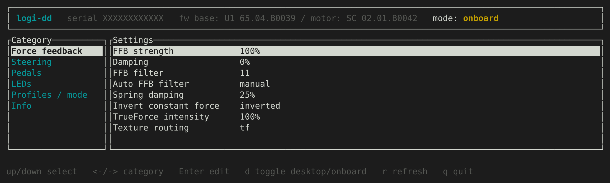
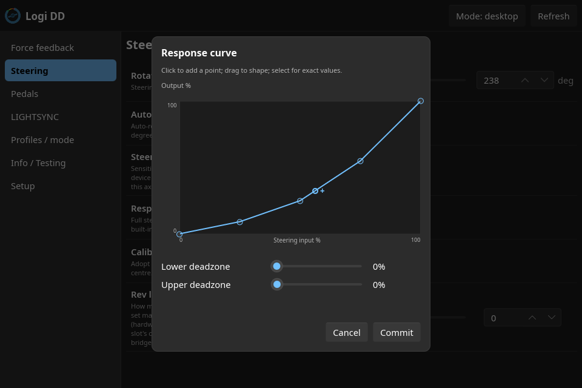
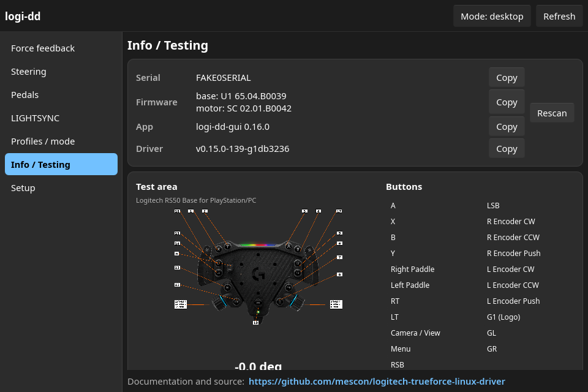
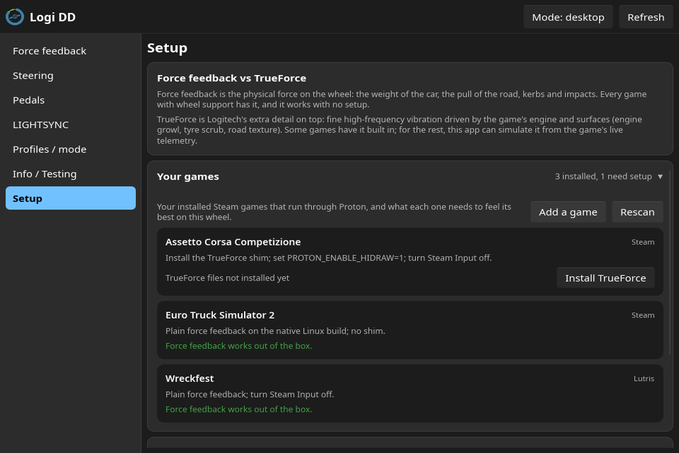

# Logitech TrueForce Linux Driver

A Linux kernel driver and userspace tools for Logitech's direct-drive racing
wheels: the **RS50** and the **G PRO Racing Wheel**. It brings force feedback,
TrueForce haptics (native, and simulated from game telemetry for titles
without it), a live RPM rev-light display, LIGHTSYNC LED control, and
G HUB-equivalent wheel settings to Linux, including in Proton/Wine sims -
all managed from a desktop app (**logi-dd-gui**) or a terminal one
(**logi-dd**).

> Not a direct-drive wheel? The belt-driven **G920 / G923** are already served
> by the in-tree `hid-logitech-hidpp` driver and do not need this one.

## What works

Force feedback, TrueForce haptics, LEDs, pedals, the RS Shifter & Handbrake, and
the full set of G HUB wheel settings all work. The RS50 is the development
hardware and is verified directly; the G PRO runs the same code path and is
expected to work, with a few items awaiting an owner's confirmation.

**Legend:** ✅ verified on hardware · 🟢 shares the verified code path, expected
to work · 🟡 needs a tester · `-` not applicable.

| Capability | RS50 | G PRO |
|---|:--:|:--:|
| Steering, pedals, buttons, D-pad | ✅ | 🟢 |
| Force feedback (full evdev effect suite) | ✅ | 🟢 |
| Force feedback in DirectInput sims (via `logi-ffb`) | 🟡 | 🟡 |
| TrueForce haptics (Proton + Logitech's signed SDK) | ✅ | 🟢 |
| Rotation range (90 to 2700°), strength, damping, filters | ✅ | 🟢 |
| Pedal response curves, sensitivity, deadzones, combined pedals | ✅ | 🟢 |
| RS Shifter & Handbrake (shift, digital + analog handbrake) | ✅ | 🟢 |
| LIGHTSYNC RGB LEDs (slots, colors, direction; edits apply live) | ✅ (faceplate strip) | 🟡 (rev lights) |
| RPM rev-light display (level fill, direction-aware) | ✅ | 🟡 |
| Simulated TrueForce from game telemetry (`logi-tf-sim`) | ✅ (sweep-verified) | 🟢 |
| Centre calibration, mode / profile switching, computer-side profiles | ✅ | 🟢 |

USB IDs covered: RS50 (`046d:c276` native, `046d:c272` compatibility mode) and
G PRO Racing Wheel (`046d:c272` Xbox/PC, `046d:c268` PS/PC).

## What's included

Six pieces, all built from this repository:

- **The kernel driver** (`hid-logitech-dd`) is the core. It exposes force
  feedback through the standard Linux evdev interface and every wheel setting
  under `/sys/.../wheel_*`. It is scoped to the direct-drive wheels and coexists
  with the in-tree Logitech driver, so no blacklisting is needed.

- **logi-dd**, a terminal settings app: a native-Linux stand-in for the parts of
  G HUB that configure the wheel, with typed, validated edits and a G HUB-style
  curve editor. So you do not have to `echo` values into sysfs by hand.

- **logi-dd-gui**, the same settings surface as a desktop app (Slint): every
  wheel setting, a LIGHTSYNC editor with per-slot colors and animation
  direction (changes apply to the wheel immediately), per-game TrueForce shim
  and simulated-TrueForce management on the Setup page, computer-side profile presets, and an
  Info / Testing page with a live input tester (rotating wheel diagram,
  button and pedal readouts) and guarded, cancelable force simulations.

  

- **logi-ffb**, a DirectInput force-feedback proxy for Wine/Proton sims that lose
  force feedback on the `PROTON_ENABLE_HIDRAW=1` path (see below).

- **logi-tf-sim**, a background daemon that synthesizes TrueForce engine
  haptics from a game's own UDP telemetry, for titles with no native
  TrueForce - and feeds the same telemetry to the wheel's rev-light strip as
  a live RPM display. Auto-detects supported games (DiRT Rally 2.0 and the
  classic Codemasters format, Automobilista 2 / Project CARS 2); enable and
  tune it per game from the Setup page.

- **libtrueforce**, a native-Linux C library reimplementing Logitech's TrueForce
  SDK, for apps that want to drive TrueForce without Wine (a telemetry-driven
  haptic generator, for example). Optional; not needed for the Proton recipe.

The distribution packages install the driver plus the `logi-dd`, `logi-dd-gui`,
`logi-ffb` and `logi-tf-sim` tools; `libtrueforce` has its own build under
`userspace/libtrueforce/`.

## Install

Pick your distribution. Full step-by-step (including the TrueForce SDK setup) is
in [**docs/GETTING_STARTED.md**](docs/GETTING_STARTED.md).

| Distribution | Install |
|---|---|
| Arch, CachyOS, Manjaro | `paru -S logi-dd-gui` (AUR, or your AUR helper; pulls `logi-dd` and the driver. Headless box: `paru -S logi-dd`) |
| Debian, Ubuntu, Mint, Pop!_OS | download the `.deb`s from [Releases](https://github.com/mescon/logitech-trueforce-linux-driver/releases), then `sudo apt install ./logitech-trueforce-dkms_*.deb ./logi-dd_*.deb ./logi-dd-gui_*.deb` (skip the gui one on a headless box) |
| Fedora, Nobara | COPR akmod: `sudo dnf copr enable mescon/logitech-trueforce && sudo dnf install akmod-logitech-trueforce logi-dd-gui` (headless box: `logi-dd` instead of `logi-dd-gui`) |
| openSUSE | OBS repo `home:mescon` (see GETTING_STARTED) |
| From source (any distro) | `git clone` this repo, then `sudo ./tools/setup.sh` (DKMS build, udev rule, everything). `./tools/setup.sh doctor` health-checks it. |

The AUR and Debian packages are DKMS-based and rebuild automatically on kernel
upgrades. After installing, plug in the wheel and check `dmesg` for a line naming
your wheel model. Add yourself to the `input` group once
(`sudo usermod -aG input "$USER"`, then log out and back in) so settings and the
tools work without root.

## Force feedback in games

- **Native and most Proton sims:** force feedback works out of the box; games see
  a standard Linux wheel. No setup beyond binding controls in game.

- **TrueForce haptics** (the high-frequency texture layer, on top of normal FFB)
  in SDK-aware sims needs Logitech's signed SDK DLLs staged into the game's Proton
  prefix, plus `PROTON_ENABLE_HIDRAW=1`. The one-time recipe is in
  [GETTING_STARTED](docs/GETTING_STARTED.md). Verified end to end on **Assetto
  Corsa Competizione** and **Assetto Corsa EVO**.

- **DirectInput sims** (Le Mans Ultimate, for example) lose force feedback with
  `PROTON_ENABLE_HIDRAW=1` because the wheel advertises no PID collection. Two
  fixes: run them with `PROTON_ENABLE_HIDRAW=0` (feedback routes through evdev),
  or prepend **`logi-ffb`** to the launch command (`logi-ffb %command%` in Steam
  launch options), which presents a virtual wheel that catches the DirectInput
  effects and forwards them to the real one. The virtual wheel appears as
  "logi-ffb Virtual Wheel" (its own name and IDs, not the real wheel's), so a
  game may need a one-time manual binding to it. `logi-ffb` is
  hardware-validated but wants an in-game tester; if you have such a sim,
  reports are very welcome.

- **Simulated TrueForce** for games without native support: enable the game
  in Setup's "Simulated TrueForce" panel, switch on the game's own UDP
  telemetry setting, and `logi-tf-sim` synthesizes engine haptics from live
  RPM and throttle - and drives the rev LEDs to match. Intensity and felt
  rev rate (pitch) are tunable; a consent-gated test sweep lets you feel it
  without a game. Hardware-verified with synthetic sweeps; in-game reports
  welcome.

## Configuring the wheel

Run **logi-dd-gui** (or **logi-dd** in a terminal) and edit settings live:
rotation range, force-feedback strength and filters, TrueForce level, LIGHTSYNC
LEDs, profiles, and per-pedal / steering response curves through a G HUB-style
curve editor.



The Info / Testing page doubles as a live input tester (does this button
reach the computer?), and the Setup page manages the game helpers:





```bash
cd userspace/logi-dd && cargo build --release
./target/release/logi-dd-gui    # desktop app; ./target/release/logi-dd for the TUI
```

Everything logi-dd sets is also available as plain sysfs attributes under
`/sys/class/hidraw/hidrawX/device/wheel_*`, and the GUI tool
[Oversteer](https://github.com/berarma/oversteer) recognizes many of them. The
complete attribute reference is in [**docs/SYSFS_API.md**](docs/SYSFS_API.md).

## Verified game support

**Assetto Corsa Competizione** and **Assetto Corsa EVO** are verified end to end
under Proton: steering, full force feedback, and TrueForce all at once (with
`PROTON_ENABLE_HIDRAW=1` and Steam Input disabled). Other Logitech-SDK sims (Le
Mans Ultimate, AMS2, Assetto Corsa, rFactor 2, iRacing) share the same SDK and are
expected to work; a confirmation for any of them is welcome.

A couple of game-side behaviors to know about (rotation-range reset at session
start, and keeping hands clear during AC EVO map loads) are documented in
[Troubleshooting](#troubleshooting) and GETTING_STARTED.

## Troubleshooting

- **No force feedback / no `wheel_*` files (wheel stuck on `hid-generic`):** the
  module did not bind. Confirm it is loaded (`lsmod | grep hid_logitech_dd`),
  replug the wheel, and check `dmesg`. `./tools/setup.sh doctor` diagnoses this.
- **Force feedback pulls the wrong way** (a native game and a Wine/Proton game can
  want opposite signs): toggle **Invert constant force** in logi-dd (the
  `wheel_ffb_constant_sign` attribute).
- **A game stops seeing the wheel after a driver reload:** restart Steam fully;
  its device list goes stale across reloads.
- **Rotation snaps to 90° at session start:** some sims reset it via their own SDK
  path; the driver restores your range automatically within 20 seconds. Re-apply
  the game's own steering-lock setting so it stops pushing 90°.

More cases, with commands, are in
[GETTING_STARTED](docs/GETTING_STARTED.md).

## Documentation

The [**project wiki**](https://github.com/mescon/logitech-trueforce-linux-driver/wiki)
is the friendliest place to start: a **Users** section (install, force feedback
in games, configuring the wheel, simulated TrueForce, troubleshooting) and a
**Developers** section (architecture, the sysfs API, the protocol
specification, libtrueforce, and the internals of `logi-ffb` and the
simulated-TrueForce daemon).

The reference documents below live in the repository, versioned with the code:

- [**GETTING_STARTED.md**](docs/GETTING_STARTED.md) - install, TrueForce SDK
  setup, per-distro notes, troubleshooting.
- [**SYSFS_API.md**](docs/SYSFS_API.md) - every `wheel_*` sysfs attribute.
- [**BUTTON_MAPPING.md**](docs/BUTTON_MAPPING.md) - which button index is which
  physical control, for binding in games (with a layout diagram).
- [**PROTOCOL_SPECIFICATION.md**](docs/PROTOCOL_SPECIFICATION.md) - the full USB /
  HID++ / force-feedback / LED protocol.
- [**TRUEFORCE_PROTOCOL.md**](docs/TRUEFORCE_PROTOCOL.md) - the TrueForce haptic
  stream format.
- [`userspace/logi-dd/README.md`](userspace/logi-dd/README.md) and
  [`userspace/logi-dd/crates/ffb-proxy/README.md`](userspace/logi-dd/crates/ffb-proxy/README.md)
  - the settings app and the FFB proxy.

## Contributing

Contributions are welcome: code, testing on hardware this project cannot reach
(a real G PRO, a DirectInput sim with `logi-ffb`), and USB captures of wheel
variants that are not yet fully supported. This driver is forked from
[JacKeTUs/hid-logitech-hidpp](https://github.com/JacKeTUs/hid-logitech-hidpp);
changes that apply to other Logitech devices are worth contributing upstream too.
Open an issue with your kernel version, distribution, and relevant `dmesg` output.

## License

- **Kernel driver** (`mainline/`), tooling, and everything else: **GPL-2.0-only**
  (see [`COPYING`](COPYING)).
- **libtrueforce** (`userspace/libtrueforce/`): **LGPL-2.1-or-later**, so native
  Linux apps may link it while changes to the library itself stay open.

Logitech's TrueForce SDK DLLs are not part of this project and are not
redistributed here; you supply them from your own G HUB installation.

## Acknowledgments

- RS50 USB protocol reverse-engineered from Wireshark captures of G HUB on Windows.
- Based on [JacKeTUs/hid-logitech-hidpp](https://github.com/JacKeTUs/hid-logitech-hidpp),
  which adds G PRO wheel support and improved force feedback.
- Upstream Linux [hid-logitech-hidpp](https://github.com/torvalds/linux/blob/master/drivers/hid/hid-logitech-hidpp.c)
  by Benjamin Tissoires and contributors.
- [Oversteer](https://github.com/berarma/oversteer) by Bernat Arlandis for the
  wheel configuration GUI.
