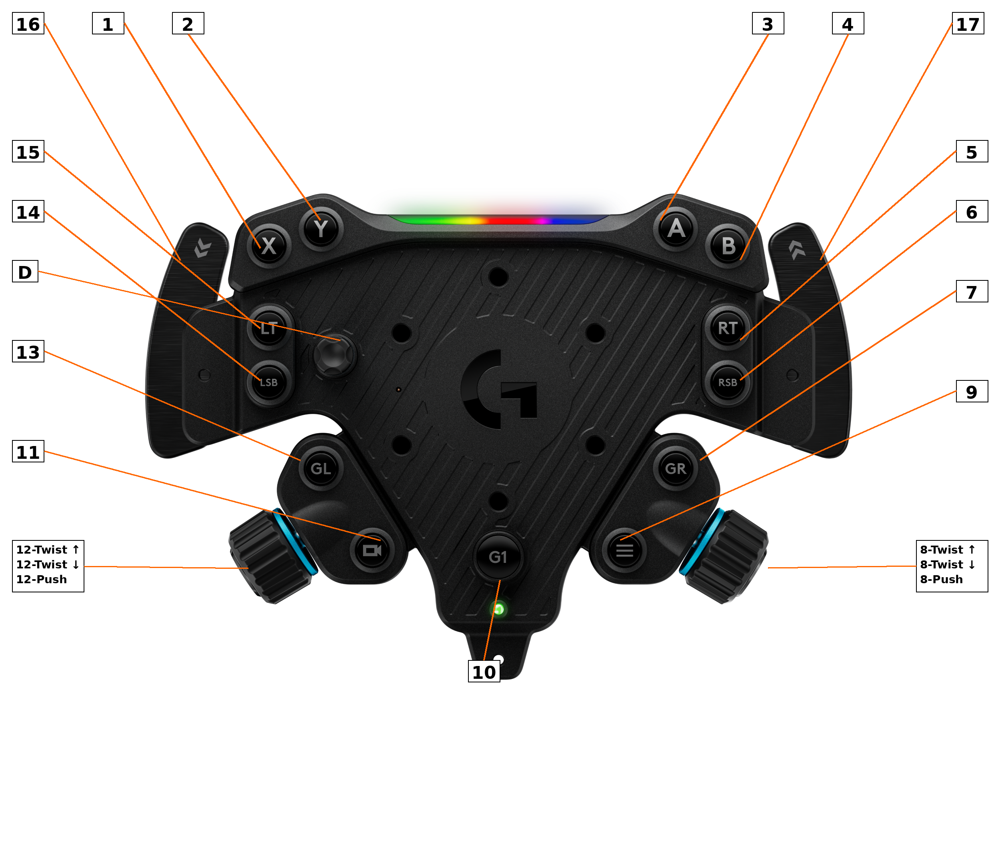

# Button Mapping

The physical controls on the RS50 / G PRO wheel and hub, and the joystick button
index each one reports. Buttons use sequential indices matching Windows
DirectInput, so bindings stay consistent across platforms.

This is the reference for binding controls in a game. The wire-level bitmask
(which report bit encodes which button) is in
[PROTOCOL_SPECIFICATION.md](PROTOCOL_SPECIFICATION.md).

The **Index** column is the joystick button number games show when binding
(sequential, matching Windows DirectInput). The **Diagram #** column is the
numbered callout box in the layout image above - the two numbering systems
are unrelated, so a button's index and its diagram number usually differ.

| Index | Button | Diagram # |
|-------|--------|-----------|
| 0 | A | 3 |
| 1 | X | 1 |
| 2 | B | 4 |
| 3 | Y | 2 |
| 4 | Right Paddle / Gear Right | 17 |
| 5 | Left Paddle / Gear Left | 16 |
| 6 | RT (Right Trigger) | 5 |
| 7 | LT (Left Trigger) | 15 |
| 8 | Camera / View | 11 |
| 9 | Menu | 9 |
| 10 | RSB (Right Stick) | 6 |
| 11 | LSB (Left Stick) | 14 |
| 21 | Right Encoder CW | 8 |
| 22 | Right Encoder CCW | 8 |
| 23 | Right Encoder Push | 8 |
| 24 | Left Encoder CW | 12 |
| 25 | Left Encoder CCW | 12 |
| 26 | Left Encoder Push | 12 |
| 27 | G1 (Logitech logo) | 10 |
| 28 | GL | 13 |
| 29 | GR | 7 |

GL and GR are their own buttons, not aliases of the shifter paddles
(hardware-verified 2026-07-20 by guided capture: evdev 0x2cc / 0x2cd,
sequential after G1).

The D-pad reports as a hat switch (`ABS_HAT0X` / `ABS_HAT0Y`), not as four
buttons - diagram callout "D".

Indices 12 to 20 are gaps in the HID descriptor (unused).
